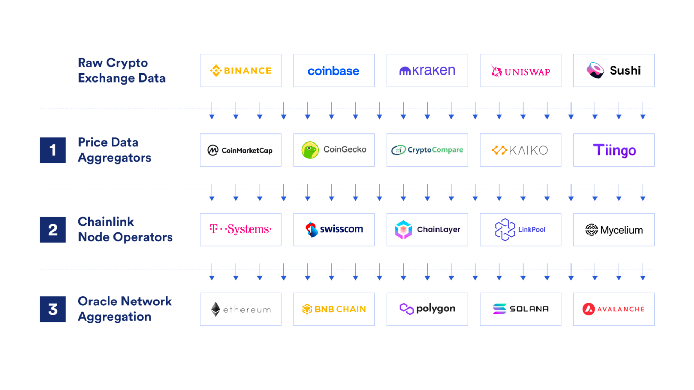

# Other Oracle Designs in DeFi

Two of the most prevalent consensus-based oracles focusing on price feed data include Chainlink, Pyth, and MakerDAO.

## Chainlink

Chainlink relies on a network of independent node operators who are rewarded with LINK tokens in exchange for honest and high-quality performance as oracles. These independent nodes deposit LINK tokens as collateral and are punished for poor performance, whether malicious or not.

A smart contract may request data, which triggers an “event”. Node operators listen for these events and in turn grab the requested off-chain data from a variety of external sources and send it over as a transaction.

The data is first aggregated by the Chainlink Nodes at the data source level. The provided responses are then in turn aggregated at the Node Operator level.

## Pyth Oracle

Pyth is focused on financial market data and partners with over 70 established firms, including large exchanges and market making firms. By connecting directly to their API, they’re able to quickly provide prices for commodities, US equities, and cryptocurrencies.

Data publishers include Jump Trading Group, Chicago Trading Company, Jane Street, and many more. These data publishers stake PYTH tokens as collateral to incentivize good behavior, and are rewarded for providing timely and reliable data. Those relying on the data may elect to pay small fees in order to gain protection from oracle failures.

## MakerDAO

MakerDAO is the largest DeFi protocol and enables collateral loans in the form of their decentralized stablecoin DAI. They use a price feed oracle to determine the prices of the posted collateral, in order to trigger liquidations when appropriate.

Price feeds are collected by individuals operating pseudonymously, as well as organizations who operate with public identities. Example organizations include well-known DeFi entities such as dYdX, 0x, and Gnosis. Those providing these price fees are voted on by MKR token holders, and these prices are inputted into what’s known as the Oracle Security Module (OSM). The OSM delays prices by an hour in order to freeze an oracle in the event of any issue or compromise.
